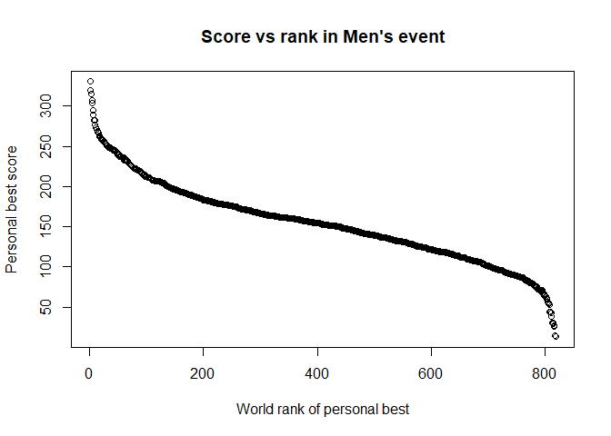
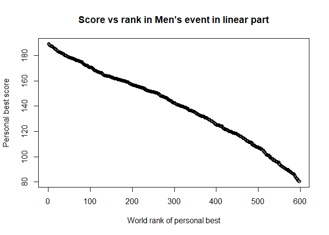

Today I am writing another piece about figure skating, also another
piece about data analysis in this event. But I am not focusing solely on
the Olympics this time but on the best scoring athletes and the best
scoring event of each athlete. There is a lot of data to go through, so
let's get right into it! The data comes from the ([International skating
Union](http://www.isu.org/statistics)) website which I downloaded on the
20/01/2018 (if you try my code and the results are different it might be
because the data on the website has changed). Reproducible blogging is
important!

Personal Best for athletes: a first look at the data
====================================================

I first load up the files I compiled from the data found on the ISU
website. The ladies' and men's event are separated into two different
files because the data is separated on the website and it wouldn't make
any sense to compare anyways. Let's check out a few lines of each the
dataframes to see how they are structured:

    ##   rank              Name NationID                          Event
    ## 1    1 Evgenia MEDVEDEVA      RUS     ISU World Team Trophy 2017
    ## 2    2          Yuna KIM      KOR  XXI Olympic Winter Games 2010
    ## 3    3 Adelina SOTNIKOVA      RUS XXII Olympic Winter Games 2014
    ## 4    4    Alina ZAGITOVA      RUS   ISU Grand Prix Final 2017/18
    ## 5    5   Satoko MIYAHARA      JPN   ISU Grand Prix Final 2016/17
    ## 6    6        Mai MIHARA      JPN     ISU World Team Trophy 2017
    ##         Date  Score Category
    ## 1 20.04.2017 241.31        S
    ## 2 25.02.2010 228.56        S
    ## 3 20.02.2014 224.59        S
    ## 4 09.12.2017 223.30        S
    ## 5 10.12.2016 218.33        S
    ## 6 20.04.2017 218.27        S

    ##   rank             Name NationID                                  Event
    ## 1    1     Yuzuru HANYU      JPN           ISU Grand Prix Final 2015/16
    ## 2    2        Shoma UNO      JPN           ISU CS Lombardia Trophy 2017
    ## 3    3 Javier FERNANDEZ      ESP           ISU World Championships 2016
    ## 4    4      Nathan CHEN      USA ISU Four Continents Championships 2017
    ## 5    5       Boyang JIN      CHN           ISU World Championships 2017
    ## 6    6     Patrick CHAN      CAN            ISU GP Trophee Bompard 2013
    ##       Date  Score category
    ## 1 12/12/15 330.43        S
    ## 2 16/09/17 319.84        S
    ## 3 01/04/16 314.93        S
    ## 4 19/02/17 307.46        S
    ## 5 01/04/17 303.58        S
    ## 6 16/11/13 295.27        S

This data is very rich, it's perfect for us. Let's break it down and
look a little more specifically. Last time I was very interested in how
France did. I was talking with a Turkish friend and she wondered what
her fellow Turkish did in the sport, so let's look at Turkish athletes
for a change:

    ##      rank                   Name NationID                            Event
    ## 293   286        Tugba KARADEMIR      TUR      European Championships 2008
    ## 420   410     Guzide Irmak BAYIR      TUR            ISU JGP Brisbane 2017
    ## 502   487             Sila SAYGI      TUR      European Championships 2013
    ## 550   531           Birce ATABEY      TUR ISU CS Denkova Staviski Cup 2015
    ## 572   552           Ilayda BAYAR      TUR            ISU JGP Riga Cup 2017
    ## 573   553             Elif ERDEM      TUR         ISU JGP Croatia Cup 2015
    ## 714   685           Sinem KUYUCU      TUR ISU CS Denkova Staviski Cup 2015
    ## 750   718        Selin HAFIZOGLU      TUR         ISU JGP Czech Skate 2013
    ## 784   748       Melisa Sema ATIK      TUR    ISU JGP Sencila Bled Cup 2012
    ## 822   781             Ekin SAYGI      TUR     ISU JGP Minsk Arena Cup 2017
    ## 845   802 Zeynep Dilruba SANOGLU      TUR      ISU JGP Cup of Austria 2015
    ## 1142 1073           Ecem ERTENLI      TUR           ISU JGP Bosphorus 2012
    ## 1183 1110              Duygu SEN      TUR             ISU JGP Austria 2011
    ## 1284 1210        Aybike KAHRIMAN      TUR           ISU JGP Bosphorus 2009
    ## 1293 1219            Buse COSKUN      TUR  Pokal der Blauen Schwerter 2004
    ## 1307 1233           Beril BEKTAS      TUR  World Junior Championships 2005
    ##            Date  Score Category
    ## 293  26.01.2008 138.73        S
    ## 420  26.08.2017 124.78        J
    ## 502  26.01.2013 119.27        S
    ## 550  23.10.2015 114.73        S
    ## 572  08.09.2017 113.06        J
    ## 573  10.10.2015 113.05        J
    ## 714  23.10.2015 101.95        S
    ## 750  05.10.2013  98.24        J
    ## 784  29.09.2012  96.70        J
    ## 822  22.09.2017  95.03        J
    ## 845  11.09.2015  93.52        J
    ## 1142 21.09.2012  73.84        J
    ## 1183 30.09.2011  70.75        J
    ## 1284 16.10.2009  52.52        J
    ## 1293 08.10.2004  49.54        J
    ## 1307 28.02.2005  41.34        J

As my friend warned me, Figure Skating is not really the national sport,
they have yet to win a medal in the Olympics in this discipline but they
do have a number of juniors that could provide an interesting suprise in
a senior category. I havent' really studied this category yet but if
you're interested in turkish figure skating they are bringing the ice
dancing couple Alisa Agafonova / Alper Uçar.

Average Personal Best scores per country
========================================

Let's look at the top 10 countries with best average PB:

    ##    NationID mean_value
    ## 60      RUS   161.5981
    ## 35      JPN   152.4915
    ## 73      USA   147.2498
    ## 12      CAN   129.0514
    ## 38      KOR   126.5404
    ## 67      SWE   124.7574
    ## 13      CHN   124.5560
    ## 34      ITA   119.2320
    ## 21      FRA   118.2176
    ## 24      GER   116.3685

    ##    NationID mean_value
    ## 49      RUS   194.9438
    ## 6       BEL   187.8933
    ## 60      USA   186.8308
    ## 12      CHN   185.5706
    ## 31      JPN   181.2509
    ## 19      FRA   172.8991
    ## 11      CAN   171.9211
    ## 52      SRB   170.6200
    ## 21      GEO   170.2317
    ## 39      MON   167.8100

Russia is well above any other country both in ladies' and men's events,
as expected. But below that there is a difference between the two
events: in ladies' Japan is second, and to my surprise USA is actually
3rd, so they're not that bad after all. In men's events, Belarus is
second and again USA is third. In both events France is in the top 10,
it could be worse, and it looks like our men's events are better. China
is also in both top tens, their artistic component is really good.
Canada is also in both lists although I expected them to be higher up
than fourth and seventh respectively. Italy is in the ladies top ten
but not in the men top 10. Other countries I don't know so much about in this
sport and were a bit of a surprise.

Rank vs score plot
==================

Now we have a pretty good idea of the countries that usually come on
top but let's focus on the athletes rather than their countries now and
look at the plot of scores and ranks:

The plot of rank according to score is interesting, it is a sigmoid. It
shows a huge chunk of competitive athletes in the middle where the drop
in rank and score is more linear. On the right side lower in the ranks,
the scores tend to drop really fast under 50 points. On the left side up
in the ranks, above 150 the scores become exponentially higher.

A linear regression model to predict the rank according to the score
====================================================================

Let's build a very simple regression
model which will work in the middle part of the plot. Regression models,
are a way to predict given a value of
rank here, the corresponding score. The reason this is interesting here,
is say I am rank 601 overall in the world for PB and I want to know what
score I will need to have to be rank 600 (come up a rank). This
regression model will tell you, which doesn't make you better at
skating, but can help you understand what kind of an effort you need to
put in to do that. So this model doesn't take into
account the fact that towards the ends of the plot it is no longer
linear, so it is not perfect, but it is a model. Let's see how good it
is:

    ## 
    ## Call:
    ## lm(formula = Score ~ rank, data = ISU_ladies_df)
    ## 
    ## Coefficients:
    ## (Intercept)         rank  
    ##    175.2582      -0.1018

    ## (Intercept)        rank 
    ## 175.2582253  -0.1018119

    ## [1] "Predicted Score with rank 601: 114.069277725803"

    ## [1] "Predicted Score with rank 600: 114.171089618544"

So if I am rank 601 according to the model my score is
114.069277725803 and if I want to jump to rank 600 I have to have a
score of 114.171089618544 so I want to add 0.1018119. But let's see how
good our model is by pulling up the actual numbers:

    ## [1] "Actual Score with rank 601: 108.77"

    ## [1] "Actual Score with rank 600: 108.86"

The model as expected is not perfect but the difference to get from one
rank to the other in reality is 0.09. Let's try to make it a little
better!

Building a better model using only the linear part of the plot
==============================================================

We will subset only the part of the plot that is pretty linear and
remove those extreme values at the ends and use the same commands as
before on that subset.

    ## 
    ## Call:
    ## lm(formula = Score ~ rank, data = new_model_df)
    ## 
    ## Coefficients:
    ## (Intercept)         rank  
    ##   161.95347     -0.08542

    ##  (Intercept)         rank 
    ## 161.95347226  -0.08541764

    ## [1] "Predicted Score with rank 601: 110.617471176053"

    ## [1] "Predicted Score with rank 600: 110.702888815125"

    ## [1] "Actual Score with rank 601: 108.77"

    ## [1] "Actual Score with rank 600: 108.86"

That's much better! the difference to get from one rank to the other in
reality is 0.09. The model still isn't perfect because the plot isnt'
completely linear.

Testing the model on the men's data
-----------------------------------

Let's do the same thing for the men's data:

    ## 
    ## Call:
    ## lm(formula = Score ~ rank, data = men_model_df)
    ## 
    ## Coefficients:
    ## (Intercept)         rank  
    ##    219.9326      -0.1731

    ## (Intercept)        rank 
    ## 219.9325997  -0.1731332

    ## [1] "Predicted Score with rank 601: 115.879553288167"

    ## [1] "Predicted Score with rank 600: 116.052686476926"

    ## [1] "Actual Score with rank 601: 118.59"

    ## [1] "Actual Score with rank 600: 118.65"

For the men's data the difference to get from one rank to the other in
reality is 0.06. It looks even better than in the ladie's data.

There is lots more to do with this data but for today that's all.

Sciathlete

Here is the code for those interested in how I did this:

    #loading libraries and reading data from ladies' and mens' events
    library(readODS)
    ISU_ladies_df <- read_ods("ISU_events_PB_ladies.ods")
    ISU_men_df <- read_ods("ISU_events_PB_men.ods")
    #showing the first six rows of the dataframes
    head(ISU_ladies_df)
    head (ISU_men_df)
    #subsetting the athletes from turkey
    athletes_turkey <- ISU_ladies_df[ISU_ladies_df$NationID == "TUR",]
    athletes_turkey
    #calculating the mean score values and showing the first 10 values
    library(plyr)
    score_nations_ladies <- ddply(ISU_ladies_df, .(NationID), summarize, mean_value = mean(Score))
    score_nations_ladies <- score_nations_ladies[order(-score_nations_ladies$mean_value),]
    head(score_nations_ladies, n=10)
    score_nations_men <- ddply(ISU_men_df, .(NationID), summarize, mean_value = mean(Score))
    score_nations_men <- score_nations_men[order(-score_nations_men$mean_value),]
    head(score_nations_men, n=10)
    #generating the ladies plot
    plot(ISU_ladies_df$Score, main="Score vs rank in Ladie's event", xlab="World rank of personal best", ylab="Personal best score")
    #calculating the coefficients and predictions
    scores.lm = lm(Score ~ rank, data=ISU_ladies_df)
    scores.lm
    coeffs = coefficients(scores.lm)
    coeffs
    pred_601 = data.frame(rank=601)
    #looking up the actual values and comparing them
    real_score_601 <- predict(scores.lm, pred_601)
    print(paste0("Predicted Score with rank 601: ", real_score_601))
    pred_600 = data.frame(rank=600)
    real_score_600 <- predict(scores.lm, pred_600)
    print(paste0("Predicted Score with rank 600: ", real_score_600))
    real_score_601 <- ISU_ladies_df[ISU_ladies_df$rank == 601,]$Score
    real_score_600 <- ISU_ladies_df[ISU_ladies_df$rank == 600,]$Score
    print(paste0("Actual Score with rank 601: ", real_score_601))
    print(paste0("Actual Score with rank 600: ", real_score_600))
    #calculating the new model with only the linear part of the plot
    new_model_df <- ISU_ladies_df[(ISU_ladies_df$rank < 1000 & ISU_ladies_df$rank > 175),]
    plot(new_model_df$Score, main="Score vs rank in Ladie's event in linear part", xlab="World rank of personal best", ylab="Personal best score")
    scores.lm = lm(Score ~ rank, data=new_model_df)
    scores.lm
    coeffs = coefficients(scores.lm)
    coeffs
    pred_601 = data.frame(rank=601)
    real_score_601 <- predict(scores.lm, pred_601)
    print(paste0("Predicted Score with rank 601: ", real_score_601))
    pred_600 = data.frame(rank=600)
    real_score_600 <- predict(scores.lm, pred_600)
    print(paste0("Predicted Score with rank 600: ", real_score_600))
    real_score_601 <- ISU_ladies_df[ISU_ladies_df$rank == 601,]$Score
    real_score_600 <- ISU_ladies_df[ISU_ladies_df$rank == 600,]$Score
    print(paste0("Actual Score with rank 601: ", real_score_601))
    print(paste0("Actual Score with rank 600: ", real_score_600))
    #applying the new model to the men's data
    plot(ISU_men_df$Score, main="Score vs rank in Men's event", xlab="World rank of personal best", ylab="Personal best score")
    men_model_df <- ISU_men_df[(ISU_men_df$rank < 750 & ISU_men_df$rank > 175),]
    plot(men_model_df$Score, main="Score vs rank in Men's event in linear part", xlab="World rank of personal best", ylab="Personal best score")
    scores.lm = lm(Score ~ rank, data=men_model_df)
    scores.lm
    coeffs = coefficients(scores.lm)
    coeffs
    pred_601 = data.frame(rank=601)
    real_score_601 <- predict(scores.lm, pred_601)
    print(paste0("Predicted Score with rank 601: ", real_score_601))
    pred_600 = data.frame(rank=600)
    real_score_600 <- predict(scores.lm, pred_600)
    print(paste0("Predicted Score with rank 600: ", real_score_600))
    real_score_601 <- ISU_men_df[ISU_men_df$rank == 601,]$Score
    real_score_600 <- ISU_men_df[ISU_men_df$rank == 600,]$Score

    print(paste0("Actual Score with rank 601: ", real_score_601))
    print(paste0("Actual Score with rank 600: ", real_score_600))
